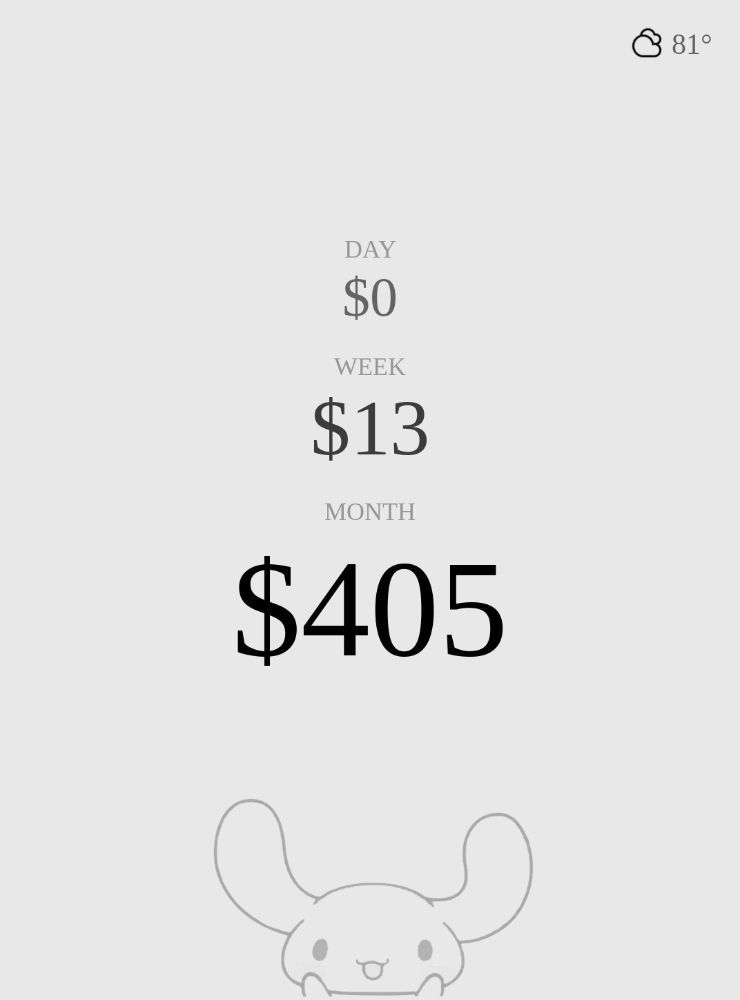

# Kindle Budget Display

A minimal, auto-updating budget dashboard for jailbroken Kindle e-ink displays. Shows daily, weekly, and monthly spending totals fetched from your bank via Plaid.



## How It Works

1. **GitHub Actions** runs hourly, fetching your transactions from Plaid
2. **Python script** calculates spending totals and generates a grayscale PNG
3. **PNG is committed** to this repo and served via GitHub Pages
4. **Kindle** (running kindle-dash) wakes hourly, fetches the PNG, displays it, and sleeps

## Setup

### 1. Create Plaid Account

1. Go to [dashboard.plaid.com](https://dashboard.plaid.com) and sign up
2. Create a new application
3. Get your **Client ID** and **Development Secret** (use Development, not Sandbox, for real bank data)

### 2. Fork/Clone This Repo

```bash
git clone https://github.com/YOUR_USERNAME/budget-kindle.git
cd budget-kindle
```

### 3. Add Your Character Image (Optional)

Put your character PNG in `assets/character.png`. It will appear at 25% opacity at the bottom of the display.

### 4. Connect Your Bank

Run the setup script locally to connect your bank via Plaid Link:

```bash
# Install dependencies
pip install -r requirements.txt

# Set your Plaid credentials
export PLAID_CLIENT_ID='your_client_id'
export PLAID_SECRET='your_development_secret'
export PLAID_ENV='development'

# Run the setup server
python setup_plaid_link.py
```

Open http://localhost:5000 and connect your bank. You'll get an **access token** - save this.

### 5. Add GitHub Secrets

Go to your repo → Settings → Secrets and variables → Actions → New repository secret

Add these three secrets:
- `PLAID_CLIENT_ID` - Your Plaid client ID
- `PLAID_SECRET` - Your Plaid development secret  
- `PLAID_ACCESS_TOKEN` - The token from step 4

### 6. Enable GitHub Pages

Go to Settings → Pages → Source → Deploy from branch → `main` / `root`

Your image will be available at: `https://YOUR_USERNAME.github.io/budget-kindle/display.png`

### 7. Trigger First Run

Go to Actions → "Update Budget Display" → Run workflow

Check that `display.png` was updated with your real spending data.

---

## Kindle Setup

### Requirements
- Kindle Paperwhite 7th gen (or similar, resolution is 1072×1448)
- Firmware < 5.18.1 (for WinterBreak jailbreak)

### Jailbreak with WinterBreak

1. Check your firmware: Settings → Device Info
2. If < 5.18.1, follow [WinterBreak instructions](https://kindlemodding.gitbook.io/kindlemodding/jailbreaking/winterbreak)
3. Very simple process - no soldering, just a few files via USB

### Install kindle-dash

1. Install KUAL and MRPI via the jailbreak
2. Download [kindle-dash](https://github.com/pascalw/kindle-dash)
3. Configure `config.sh`:

```bash
REFRESH_SCHEDULE="0 * * * *"  # Every hour
IMAGE_URI="https://YOUR_USERNAME.github.io/budget-kindle/display.png"
```

4. Copy to Kindle and run from KUAL

---

## Local Testing

Generate a test image with sample data:

```bash
python generate_display.py
# Creates display.png with demo values
```

With real Plaid data:

```bash
export PLAID_CLIENT_ID='...'
export PLAID_SECRET='...'
export PLAID_ACCESS_TOKEN='...'
export PLAID_ENV='development'

python generate_display.py
```

---

## Customization

### Spending Categories

Edit `EXCLUDED_CATEGORIES` in `generate_display.py` to change what's counted as "spending":

```python
EXCLUDED_CATEGORIES = [
    'Transfer', 'Credit Card', 'Deposit', 'Payment', 
    'Bank Fees', 'Interest', 'Tax'
]
```

### Update Frequency

Edit `.github/workflows/update.yml` cron schedule:

```yaml
schedule:
  - cron: '0 * * * *'  # Every hour
  # - cron: '0 */4 * * *'  # Every 4 hours
  # - cron: '0 8,20 * * *'  # 8am and 8pm
```

### Display Layout

The image is generated at 1072×1448 pixels (Kindle Paperwhite 7th gen resolution). Adjust `generate_display.py` for different Kindle models.

---

## Troubleshooting

**Image not updating?**
- Check Actions tab for workflow errors
- Verify GitHub secrets are set correctly
- Make sure GitHub Pages is enabled

**Kindle not refreshing?**
- Check WiFi connection on Kindle
- Verify kindle-dash config points to correct URL
- Check that GitHub Pages URL is accessible

**Wrong spending amounts?**
- Plaid may take a day to sync new transactions
- Check category exclusions match your needs
